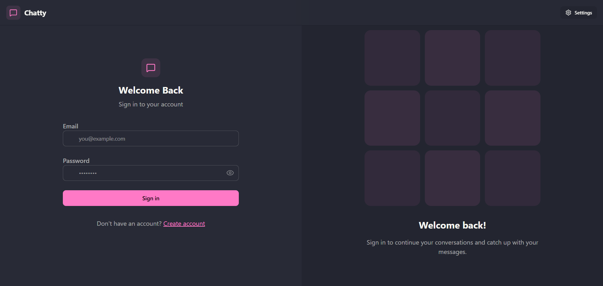
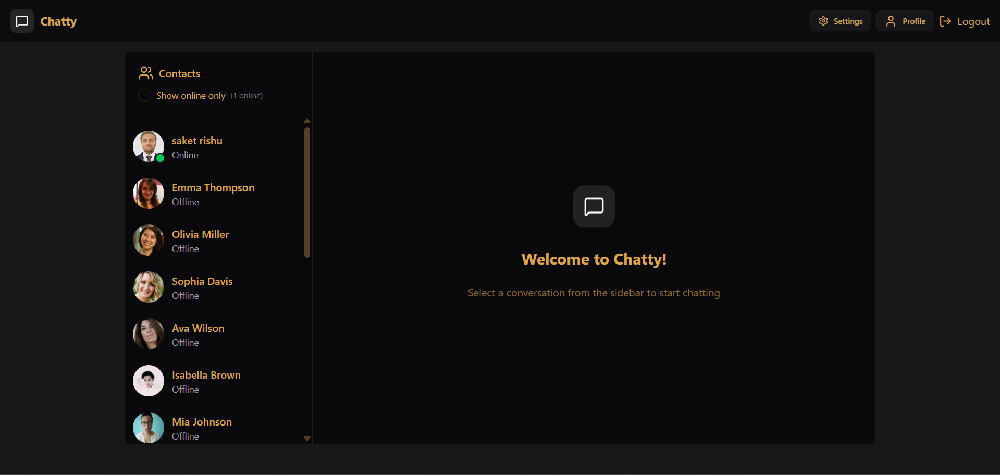
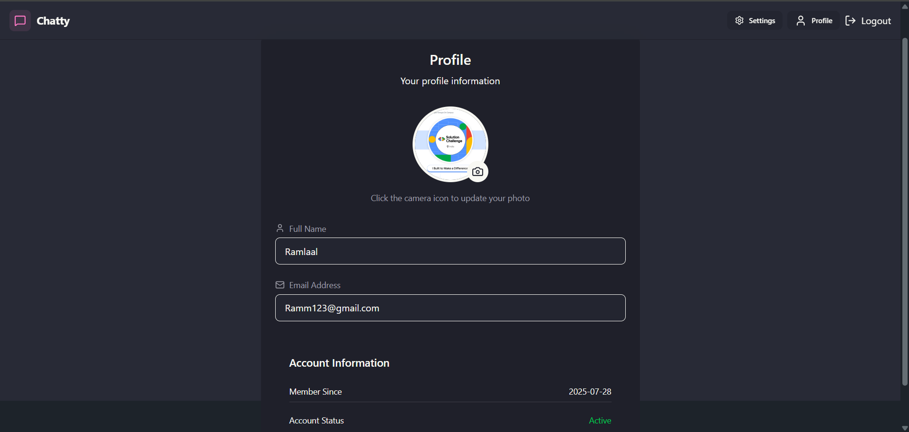
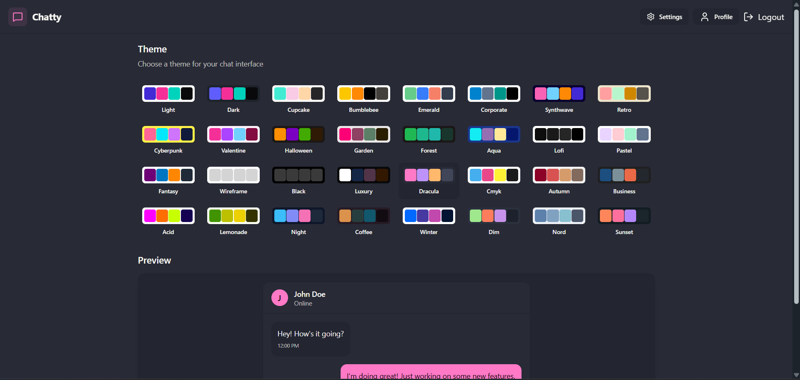
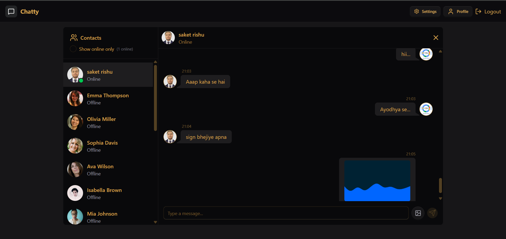
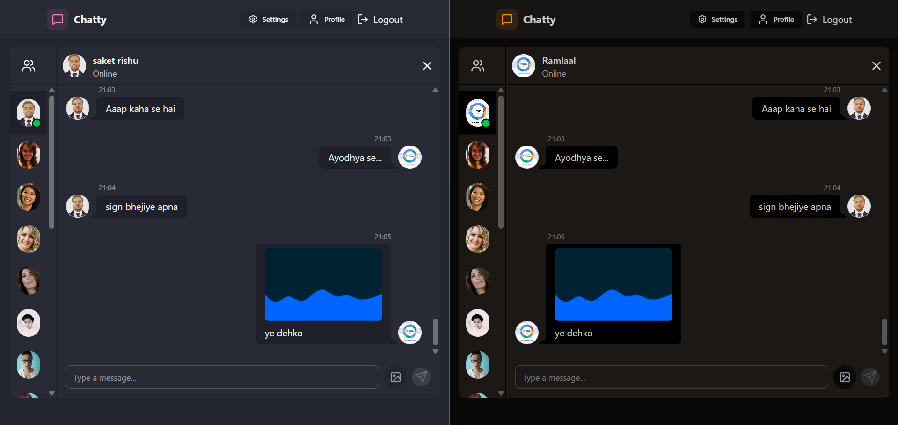

# 💬 Chatty - Real-Time Full Stack Chat Application

🚀 [Live Demo](https://fullstack-chat-app-rtx0.onrender.com)

Chatty is a full-stack real-time chat application built with the MERN stack, enhanced with WebSockets for instant messaging. It supports both text and image chats, secure JWT authentication, dynamic themes, and a polished UI for a modern messaging experience.

---

## 📸 UI Preview

| 🔐 Login Page | 🏠 Home Page |
|--------------|--------------|
|  |  |

| 🙍‍♂️ Profile Page | ⚙️ Settings Page |
|------------------|------------------|
|  |  |

| 💬 Chat Page | ⚡ Real-Time Chat (Two Users) |
|----------------|-------------------------------|
|  |  |

---

## ✨ Features

- 🔐 Secure Authentication (JWT + bcrypt)
- 🧑‍💼 Profile Management with Image Upload (Cloudinary)
- 💬 Real-Time Messaging (Socket.IO)
- 📸 Chat with Text and Image Support
- 🌐 Online/Offline Status Indicators
- 🎨 32+ Theme Options via DaisyUI
- 📱 Responsive UI with Skeleton Loaders
- 🧠 Zustand for State Management
- ☁️ Cloud Deployment via Render

---

## 🛠️ Tech Stack

### 🔹 Frontend
- React
- Tailwind CSS
- DaisyUI
- Zustand
- React Router DOM
- Axios
- React Hot Toast

### 🔹 Backend
- Node.js + Express
- MongoDB + Mongoose
- JSON Web Tokens (JWT)
- bcrypt.js
- Socket.IO
- Cloudinary SDK
- dotenv + cookie-parser

---

## 🗂️ Project Structure

```

Chatty/
├── backend/                    # Express.js backend server
│   ├── src/
│   │   ├── controllers/        # Logic for routes (auth, messages, user)
│   │   ├── models/             # Mongoose models (User, Message)
│   │   ├── routes/             # Route definitions (authRoutes, messageRoutes)
│   │   ├── lib/                # Cloudinary config and utility functions
│   │   └── middleware/         # JWT auth middleware (optional)
│   ├── index.js                # Entry point for Express app
│   └── .env                    # Environment variables (MongoDB URI, JWT secret, etc.)

├── frontend/                   # React + Vite front-end
│   ├── src/
│   │   ├── components/         # Reusable UI components (Navbar, ChatBox, etc.)
│   │   ├── pages/              # Route-specific pages (Login, Signup, Chat, Profile)
│   │   ├── store/              # Zustand state stores (auth, theme, chat)
│   │   ├── App.jsx             # Main App component
│   │   └── main.jsx            # React DOM entry point
│   ├── tailwind.config.js      # Tailwind CSS configuration
│   └── index.html              # HTML template

├── assets/
│   └── screens/                # Screenshots for README.md

├── package.json                # Root scripts for build & deployment
├── README.md                   # Project documentation
└── .gitignore                  # Files to ignore in Git


````

---

## ⚙️ Getting Started

### 🔧 Clone the Repository

```bash
git clone https://github.com/yourusername/chatty.git
cd chatty
````

### 📦 Install Dependencies

```bash
# Backend
cd backend
npm install

# Frontend
cd ../frontend
npm install
```

### 🔑 Environment Variables

Create a `.env` file inside `/backend`:

```env
PORT=5000
MONGODB_URI=your_mongodb_uri
JWT_SECRET=your_jwt_secret
CLOUDINARY_CLOUD_NAME=your_cloud_name
CLOUDINARY_API_KEY=your_api_key
CLOUDINARY_API_SECRET=your_api_secret
```

### ▶️ Run Locally

```bash
# Backend
cd backend
npm run dev

# Frontend
cd ../frontend
npm run dev
```

---

## 🌩️ Real-Time Functionality (Socket.IO)

* 🔄 Real-time message updates
* 🟢 Tracks online/offline status
* 📨 Emits and receives messages instantly
* 🔔 Chat updates without refresh

---

## 🧠 State Management with Zustand

* `useAuthStore`: Auth state & actions
* `useThemeStore`: Theme persistence
* `useChatStore`: Current chat & messages

---

## 🔒 Authentication Flow

1. User signs up / logs in
2. Server validates and issues a JWT
3. Token stored in cookies for secure auth
4. Middleware checks token on protected routes

---

## 🚀 Deployment (Render)

### ✅ Key Deployment Scripts (in root `package.json`)

```json
"scripts": {
  "start": "npm run start --prefix backend",
  "build": "npm install --prefix backend && npm install --prefix frontend && npm run build --prefix frontend"
}
```

### 🌍 Deployment Steps

1. Push code to GitHub
2. Create a Web Service on Render
3. Add environment variables (MongoDB, JWT, Cloudinary)
4. Connect frontend + backend
5. Set up static serving of React in backend

---

## ✅ Todos / Future Enhancements

* [ ] Group Chat
* [ ] Typing Indicators
* [ ] Message Read Receipts
* [ ] Edit/Delete Messages
* [ ] Emoji Picker Integration
* [ ] Push Notifications

---

## 🙌 Acknowledgements

* [MongoDB Atlas](https://www.mongodb.com/cloud/atlas)
* [Render](https://render.com/)
* [Tailwind CSS](https://tailwindcss.com/)
* [Cloudinary](https://cloudinary.com/)
* [Socket.IO](https://socket.io/)
* [Zustand](https://zustand-demo.pmnd.rs/)

---

## 🧾 License

This project is licensed under the [MIT License](LICENSE).

---

## 📞 Connect

* 💼 [LinkedIn](https://linkedin.com/in/saket-chaudhary22)
* 💻 [GitHub](https://github.com/Saket22-CS)
* ✉️ [saketrishu64821@gmail.com](mailto:saketrishu64821@gmail.com)
